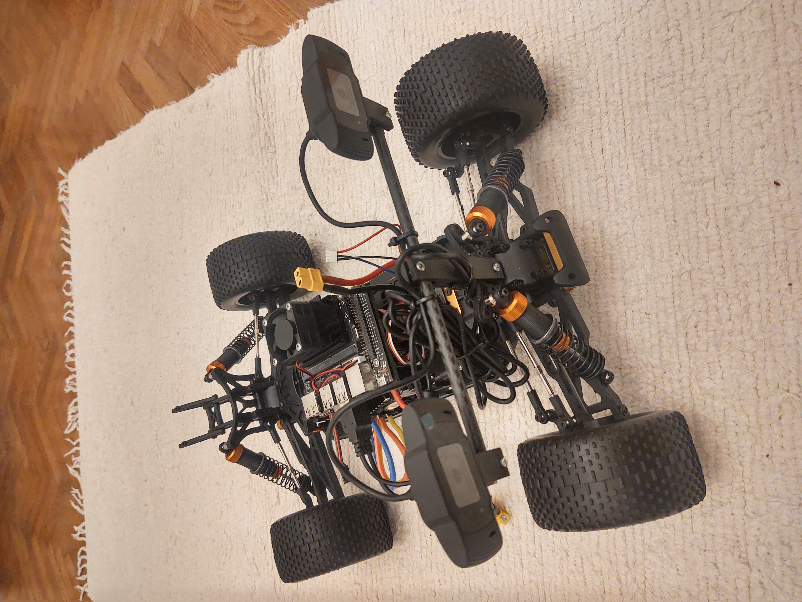
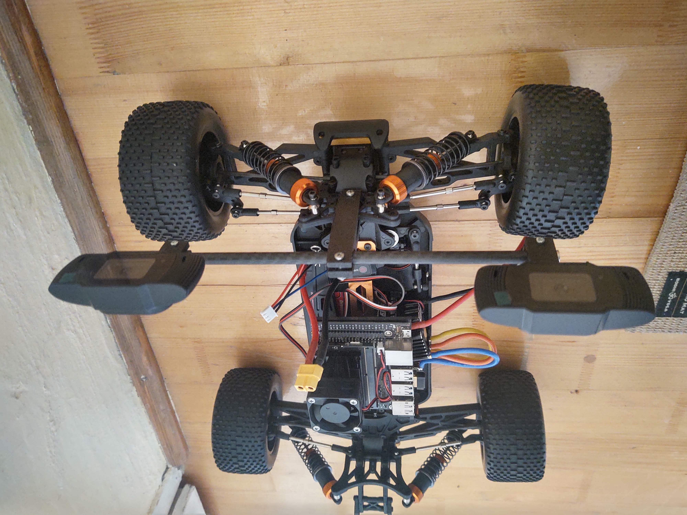
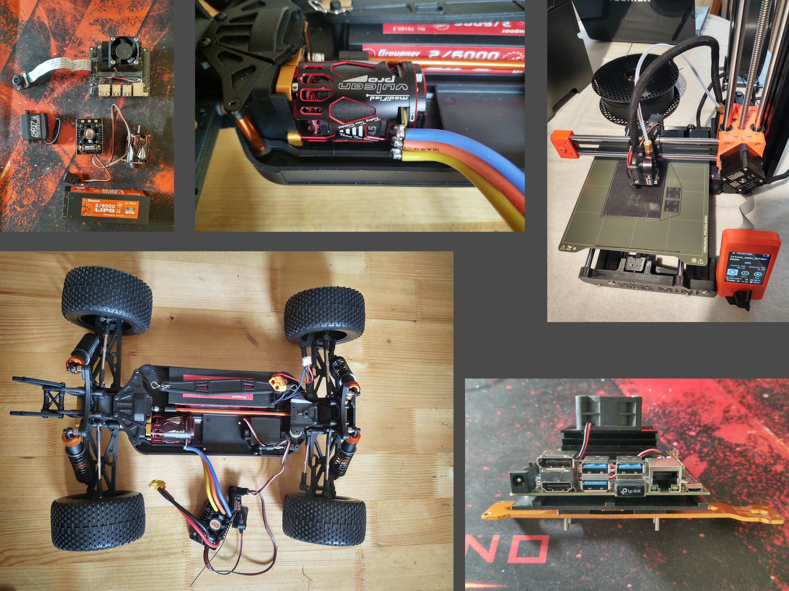
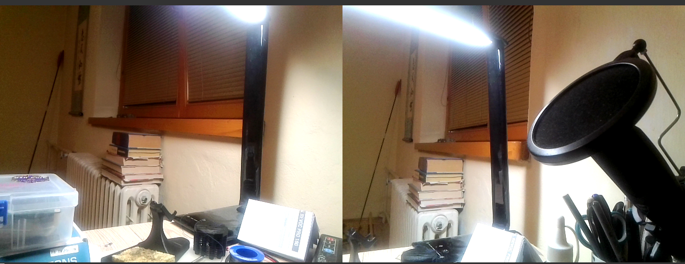
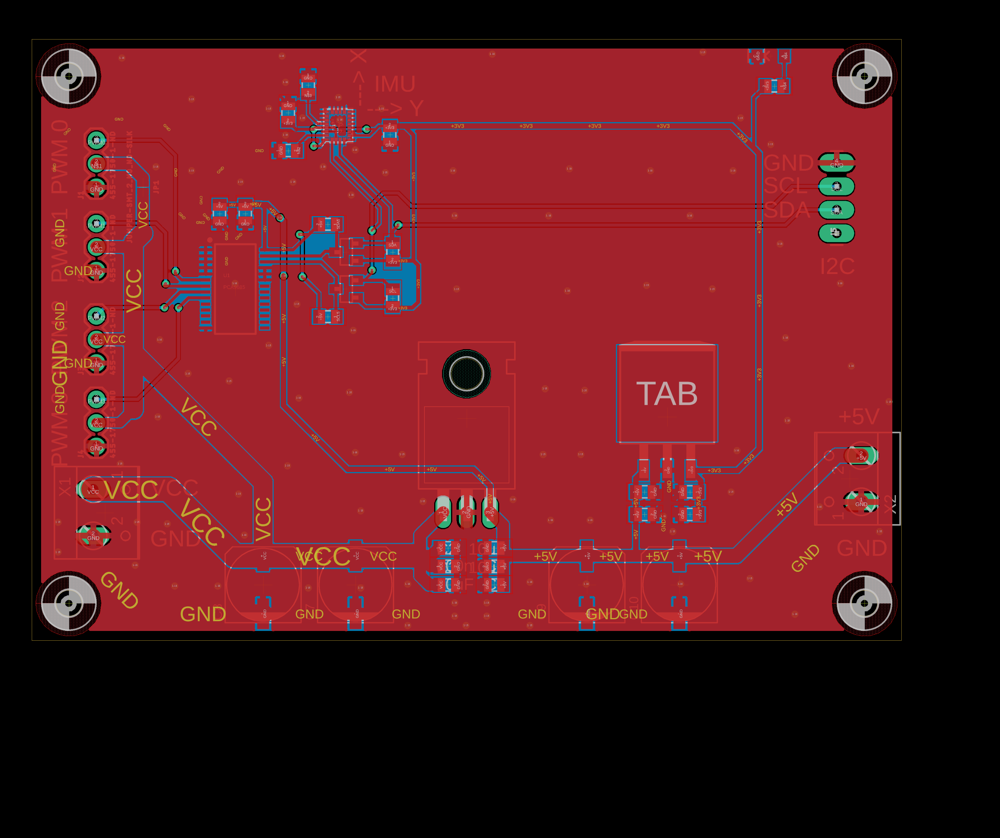

# newton - outdoor robot

**first look from stereovision camera**

# hardware

- nvidia jetson nano 128Cuda cores
- two cameras, wifi
- sensored brushless motor, 160A ESC
- some random servo
- chassis : RC truggy 1:10 scale
- power 2S LiPol

TODO :
- pwm and gyro board

